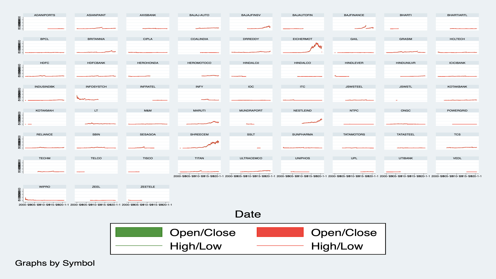

## Stata Tutorial

### File Description

+ main.do: The main file for this Tutorial

+ highlow.png: The graph for high and low price grouped by different symbols.

+ openclose.png: The graph for open and close price grouped by different symbols.

+ candlechart.png: Sample output for the candle chart. (optional)

+ acf&pacf: The directory contains ***autocorrelation*** and ***partial autocorrelation*** graphs for selected symbols.

+ ModelSelection: The directory contains ***model selection criterions*** (**AICs** and **BICs**) and ***model selection results*** (**coefficients**, **p-values**) for selected symbols.

+ FittedPlots: The directory contains fitted values against original points for selected symbols.

### General Tutorial Notes

#### Data Loading and Cleaning
  The data set *NIFTY50_all.csv* is read into Stata and some unnecessary variables are dropped.
  **Note**: In order to treat the data as time series data, we need to transform the date variable from the string format to date format.

#### Data Visualization
  The graphs high, low, open, close price for different symbols are generated pairwise (high & low, open & close). A more powerful graph is the Japanese candle chart, which is frequently used in stock market. The sample graph is:

#### Model Selection

  After looking at the candle charts, four specific stock symbols are selected and they are: *EICHERMOT*, *INFOSYSTCH*, *NESTLEIND* and *SHREECEM*. This is because their data is more complete than others. Also, their prices all experience huge up and downs, which can be great to test the robustness of our model.

  We first graph the autocorrelation and partial autocorrelation for the volume weighted average price in different symbols and the result is stored in the *acf&pacf* folder. Sample graphs for these are (*EICHERMOT* case):

  After examing all the acf and pacf graphs, I decide to use these models for further model testing:

  + AR(1)

  + AR(2)

  + ARMA(1,1)

  These models are constructed using *arima* commands and ***AICs***/***BICs*** results are stored into excel files, coefficients and p-values are stored into txt files. Both of these files can be found in the *ModelSelection* folder.

#### Model Evaluation

  It turns out that the ARMA(1,1) model gives the smallest AIC and BIC in almost all four cases. Hence it is chosen to fit the model. The fitted plots can be found in the *FittedPlots* folder and a sample output is (*EICHERMOT* case):

### TODO List

+ Fix line too long problems (Noted in the source code).

+ Add more comments / instructions in the source code.

+ Polish the final presentation document.
